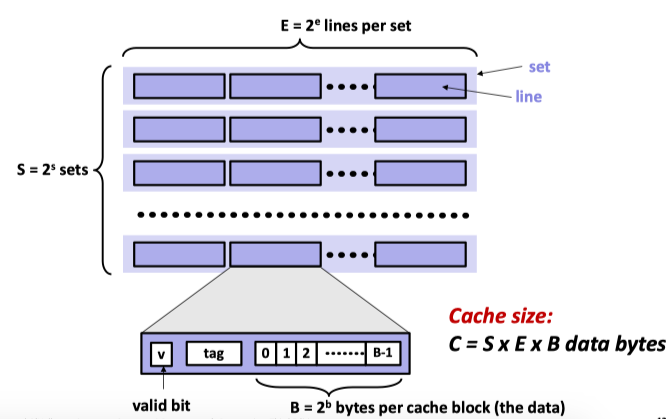

## 内容概述

在这一章的主要知识点是“memory hierachy”。CPU是计算的核心，它进行数据计算的数据源自其内部的register(寄存器)，这也是访问速度最快的存储空间。register里面的数据是从内存(memory)中来，而内存里面的数据从硬盘中来。我们一般在谈论memory hierachy的时候不怎么谈论memory-disk这部分的数据传输，因为程序在运行前，加载器会把程序指令和相关数据加载到内存中，而在程序运行中需要访问disk的情况属于IO的范畴了。

register的访问速度要比memory的访问速度要快上几十倍，我之前一直有一个疑惑，为什么不把register做的大一些呢，或者数量多一些？这个原因在于，虽然register很快，但是其费用高昂，需要很多的电量(产生热量)，所以register的数量有限，容量不高。64-bit的机器有16个寄存器，每一个大小为64 bit。

register和memory的速度差异极大的降低了程序运行的速度。缓存(cache)的使用是为了弥补它们速度的差异。就名字而言，缓存无非就是把我们程序运行所需要的**相关**数据找一个比memory访问速度更快的空间放起来，这样在用的时候就可以快速的拿到数据了。道理是这个道理，但是仔细的想一想就会有一些问题。我们如何去定义“相关”？计算机又是如何知道哪些数据是相关的呢？要想解释这个问题，就需要引出程序中的两个概念:

* spatial locality
* temporal locality

Temporal locality的含义是我们的程序在运行中倾向于使用连续地址空间里的数据，比如数组。Spatial locality的含义是我们的程序在运行中倾向于使用之前被使用过的数据。利用这两个概念，我们就可以构建缓存空间，当程序需要访问某个数据时，我们不仅仅是把它从memory中读出，而是把它和它附近连续地址内的数据都读出来，放在缓存中。这样当我们的代码有spatial locality时，我们就不需要再去memory中寻找数据了，可以直接从cache中拿到，当cache中没有时，我们再去memory中寻找。

举个例子：

```C
int sum = 0;
for (int i=0; i<n; i++)
	sum += a[i];
```

* 我们以stride 1 按顺序访问数据，利用了spatial locality。假设我们只有一个cache，大小为32 Byte，那么它就可以存放4个int数据。所以第一次访问a[0]时，计算机发现cache中没有a[0]的存在，就去memory中提取数据，把a[0,1,2,3]都提取到cache中。这样后续在访问a[1], a[2], a[3]的时候就可以直接从缓存中读取了。
* sum利用了temporal locality。当sum被读取进cache后就可以在cache中进行读写操作了。

所以我们利用缓存能够加速程序的运行，完全是因为有spatial, temporal locality的存在，而它们的存在取决于我们代码的写法。好的代码使得locality得到最大限度的利用，坏的代码在极端情况下让cache失去作用(夸张说法)。

## cache详解

在这一节中，我们来详细分析一下cache的结构。在现代处理器中，cache一般分为三级L1，L2，L3，它们的区别在于容量(capacity)。利用多极cache自然是为了最大限度提高数据访问的速度。

### cache 类别

cache可以分为两种：direct mapped cache 和 E-way associate cache。



对于E-way associate cache而言，当发生miss时需要load data，我们选择任意一个empty的cache line即可。当没有empty的cache时，我们就需要进行eviction把其他valid的cahce数据覆盖掉。选择哪一个覆盖取决于算法，一个简单的算法是LRU(Least Recently Used)。

一个cache由S个set组成，每个set由E个line组成，每个line的内容为：valid bit, tag, block。

* valid bit: 用于确定block中的数据是否是合法的。
* tag: 用于比较来确定cache中所存的数据是不是我们所要的。
* block: 用于存储数据。

对于一个地址，其低b位为block offset，接着高s位为set index，剩下的高位为tag。cache每一次transfer的数据大小为一个block。

## cache write

相比于read，write更为复杂一些，这里单独讨论一下。

1. write hit
	* write-through: write immediately to memory.
	* write-back: defer write to memory until replacement of line. We need a dirty bit to implement this policy.

2. write miss
	* write-allocate: load into cache, update line in cache.
	* no-write-allocate: write straight to memory, does not load into cache.

一般来说，上述四种policy形成了两种组合：

1. write-through + no-write-allocate
2. write-back + write-allocate

