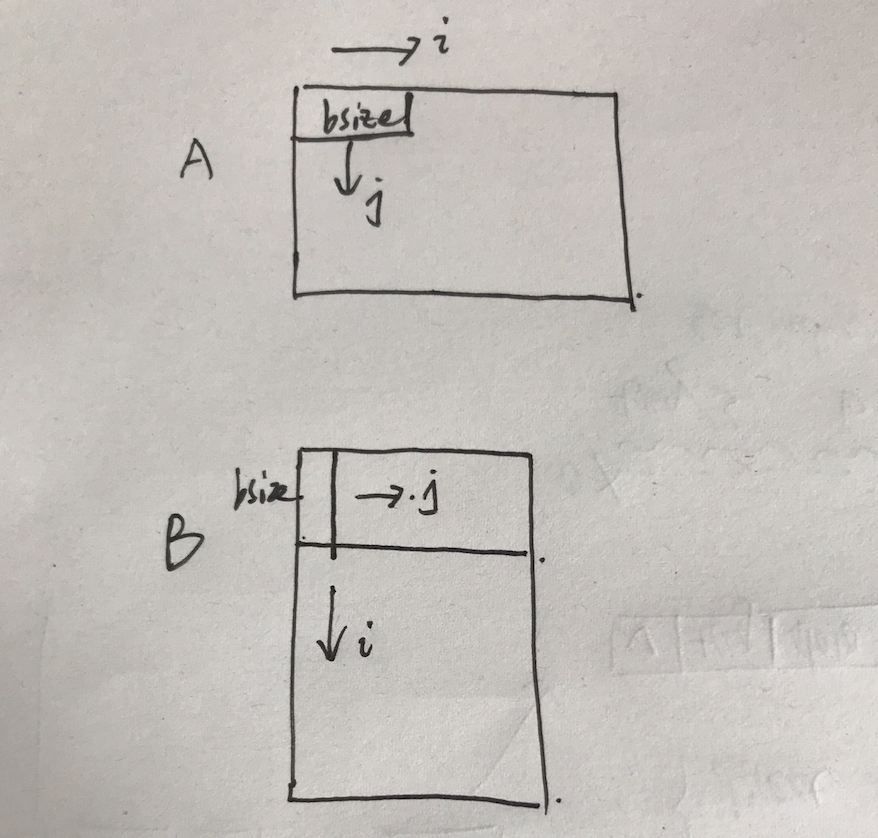

这个实验总共分为两部分，第一部分是cache模拟器，需要学生模拟cache的行为，给出正确的hit, miss, eviction判断。第二部分是优化矩阵转置，尽可能的减少miss的次数。

## 环境说明

Running the autograders:

Before running the autograders, compile your code:
    linux> make

Check the correctness of your simulator:
    linux> ./test-csim

Check the correctness and performance of your transpose functions:
    linux> ./test-trans -M 32 -N 32
    linux> ./test-trans -M 64 -N 64
    linux> ./test-trans -M 61 -N 67

Check everything at once (this is the program that your instructor runs):
    linux> ./driver.py    

Files:

You will modifying and handing in these two files

csim.c       Your cache simulator
trans.c      Your transpose function

Tools for evaluating your simulator and transpose function

Makefile     Builds the simulator and tools
README       This file
driver.py*   The driver program, runs test-csim and test-trans
cachelab.c   Required helper functions
cachelab.h   Required header file
csim-ref*    The executable reference cache simulator
test-csim*   Tests your cache simulator
test-trans.c Tests your transpose function
tracegen.c   Helper program used by test-trans
traces/      Trace files used by test-csim.c

## cache simulator

我的代码设计思路如下：

1. 利用struct结构构建cache line，存储valid bit, tag, LRU counter
2. 利用malloc函数分配cache为一个二维数组，类型为cache line
3. 每读取一个address，利用process函数提取出tag, set index 信息
4. 根据set-index, tag 利用calculate函数判断cache行为，同时更新相关的信息。(注意hit需要更行LRU counter)

## matrix transpose

每次从A读取bsize的部分，复制到B中去。第一次都会miss，但是第二次开始的bsize次，由于spatial locality的存在不会miss。能够做到这一点是因为cache每次传输的数据大小为block size。

有一点要格外注意，那就是注意矩阵的M和N，当矩阵A的M过大时，B[bsize][j]会超出cache的大小，导致miss eviction。我的解决方法是减小外循环的step size。

循环示意图如下：

## result

见result.txt

